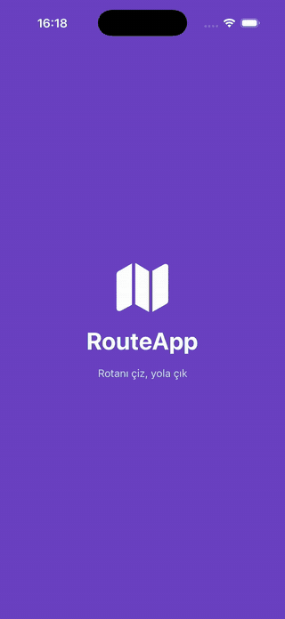
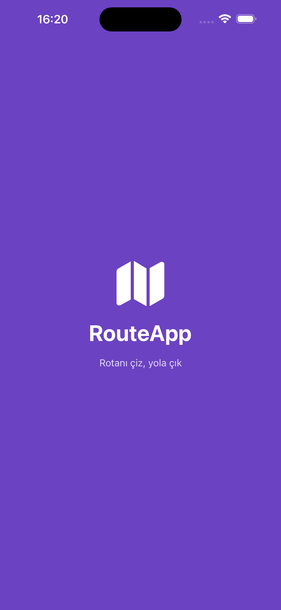
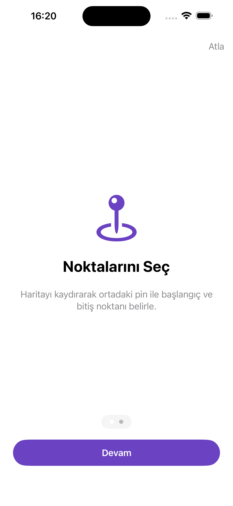
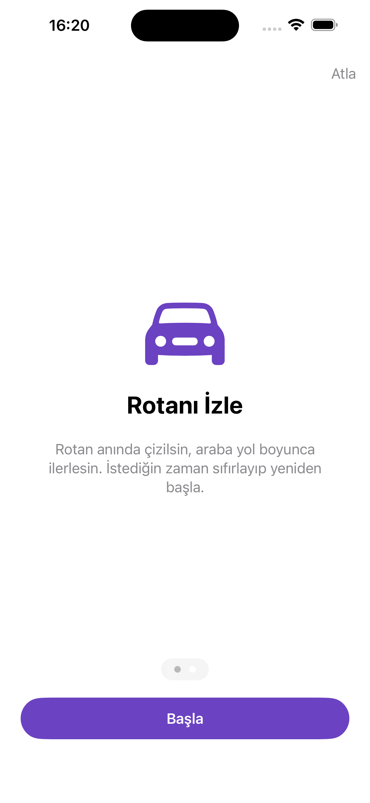
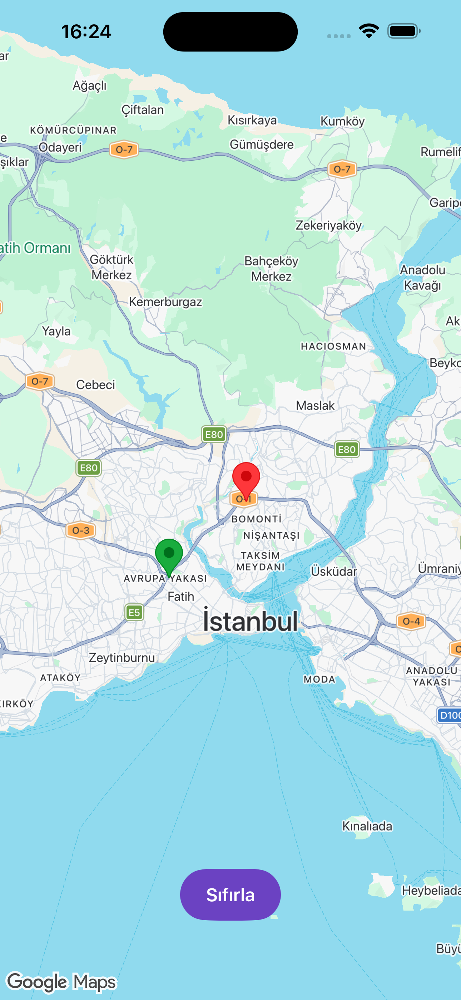
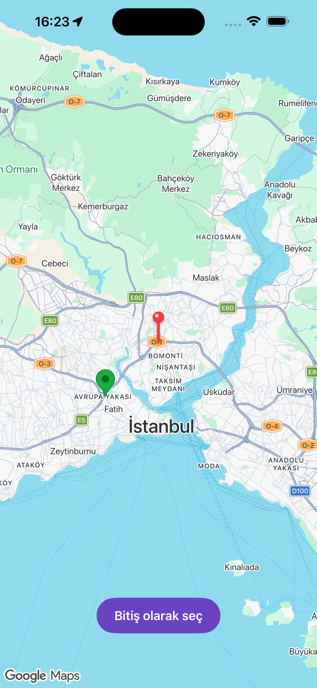

# RouteApp 🗺️

Haritadan başlangıç ve bitiş noktası seçip iki nokta arasındaki rotayı çizen, rotayı araba animasyonuyla gösteren bir iOS uygulaması.

**SwiftUI + MVVM** mimarisiyle, **Google Maps SDK** ve **Google Routes API** kullanılarak geliştirildi.

<p align="center">
  
</p>

## Ekran Görüntüleri

| Splash | Onboarding 1 | Onboarding 2 | Nokta Seçimi | Rota |
|:---:|:---:|:---:|:---:|:---:|
|  |  |  |  |  |

## Özellikler

- **Splash ekranı:** Uygulama açılışında kısa süre görünen marka ekranı.
- **Onboarding (2 sayfa):** Sadece ilk açılışta gösterilir (`@AppStorage`). "Atla" ile geçilebilir.
- **Konum izni:** İzin verilirse harita kullanıcının konumuna odaklanır; reddedilirse uygulama İstanbul'dan açılarak çalışmaya devam eder.
- **Pin ile nokta seçimi:** Ekranın ortasındaki pin ile haritayı kaydırarak başlangıç ve bitiş noktası seçilir.
- **Rota çizimi:** Google Routes API'den gelen encoded polyline haritaya çizilir, kamera rotaya sığdırılır.
- **Araba animasyonu:** Araba rota boyunca, gittiği yöne dönerek ilerler.
- **Sıfırla:** Animasyon sırasında bile her şeyi temizleyip baştan başlatır.
- **Yükleniyor ve hata durumları:** İstek sırasında yükleniyor göstergesi; internet yokken, aynı nokta seçildiğinde veya rota bulunamadığında kullanıcıya anlaşılır hata mesajı.

## Kullanılan Teknolojiler

| Alan | Teknoloji |
|---|---|
| Arayüz | SwiftUI |
| Mimari | MVVM |
| Harita | Google Maps SDK for iOS (Swift Package Manager) |
| Rota | Google Routes API (`computeRoutes`) |
| Ağ | URLSession, async/await, Codable |
| State | Observation (`@Observable`), `@State`, `@AppStorage` |
| Konum | CoreLocation (`CLLocationManager`) |
| UIKit köprüsü | `UIViewRepresentable` + Coordinator |

## Mimari

```
RouteAppApp
   └── RootView              → Splash / Onboarding / Harita arasında karar verir
         ├── SplashView
         ├── OnboardingView
         └── ContentView     (View)
               ├── MapViewModel     (ViewModel: seçim, rota, yükleniyor/hata durumu)
               │     └── RouteService   (Model katmanı: Routes API isteği)
               ├── LocationManager  (konum izni ve kullanıcı konumu)
               └── MapView + Coordinator  (GMSMapView'ı SwiftUI'a bağlar)
```

- **View** sadece çizer ve kullanıcı etkileşimini ViewModel'e iletir.
- **ViewModel** state'i tutar ve değiştirir; View'dan haberi yoktur. State değişince SwiftUI ekranı kendiliğinden günceller.
- **RouteService** bir protokol (`RouteServiceProtocol`) arkasında durur ve ViewModel'e dışarıdan verilir (dependency injection). Böylece testlerde gerçek API yerine sahte bir servis kullanılabilir.

## Kurulum

1. Repoyu klonla:
   ```bash
   git clone https://github.com/btlrn/RouteApp.git
   ```
2. [Google Cloud Console](https://console.cloud.google.com/)'da bir API key oluştur ve şu iki API'yi etkinleştir:
   - **Maps SDK for iOS**
   - **Routes API**
3. Projenin ana klasöründe `Secrets.xcconfig` adında bir dosya oluştur ve içine key'ini yaz:
   ```
   GOOGLE_MAPS_API_KEY = buraya_kendi_keyin
   ```
   Bu dosya `.gitignore`'da olduğu için GitHub'a yüklenmez.
4. Xcode'da projeyi aç, **PROJECT → Info → Configurations** altında Debug ve Release için `Secrets`'ı seç.
5. **Cmd + R** ile çalıştır. Simülatörde konum için: **Features → Location → Apple**.

> Gereksinim: iOS 17+ (`@Observable` kullanıldığı için).

## Teknik Notlar

- **API key güvenliği:** Key hiçbir Swift dosyasında yazmıyor. Akış: `Secrets.xcconfig` → derleme sırasında `Info.plist` → `Bundle.main` → `GMSServices`. Key ayrıca Google Cloud'da bundle ID ve API ile kısıtlandı.
- **Sonsuz döngü koruması:** `updateUIView` her state değişiminde çağrıldığı için, Coordinator en son çizdiği rotayı (`drawnPath`) saklar ve aynı rotayı tekrar çizmez.
- **Eski animasyonların iptali:** Her yeni animasyon bir numara (`animationID`) alır. Sıfırlama veya yeni rota numarayı artırdığında, çalışan eski animasyon zinciri kendini durdurur.
- **Polyline:** Rota Google'dan sıkıştırılmış (encoded polyline) bir metin olarak gelir ve SDK'nın `GMSPath(fromEncodedPath:)` fonksiyonuyla çözülür.

## Geliştirme Fikirleri

- Konum yönetimini ViewModel'e taşıyarak MVVM ayrımını güçlendirmek
- `MapViewModel` için birim testleri (sahte `RouteService` ile)
- Rota süresi ve mesafesini ekranda göstermek
- Alternatif rotalar ve ulaşım türü seçimi (yürüyüş, bisiklet)
